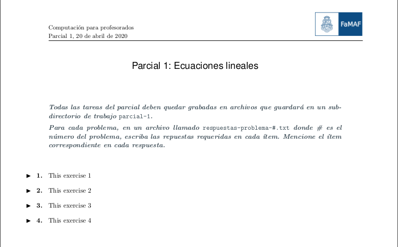

**********************
Templates
**********************

Any latex file can be used as a template for the exams.
The part with the exercises must contain the following:

.. code:: latex

   \newenvironment{ejj}[1]%
   {\addtocounter{ejnro}{1}\hspace{-1.2cm}$\blacktriangleright$\hspace{.3cm}{\textb
   f{\arabic{ejnro}.}}\hspace{.3cm}}%
   {\vspace{5pt}}

in the preamble, and

.. code:: latex

   \BLOCK{ for ej in exs } 
      \begin{ejj}
         \VAR{ej}
      \end{ejj}
   \BLOCK{ endfor }

in the main document.

An example template file, ``template.tex`` is provided, which can be
easily modified. This template uses a logo (for Famaf, UNC), which can
be replaced.

The result for the sample template file is as follows:

